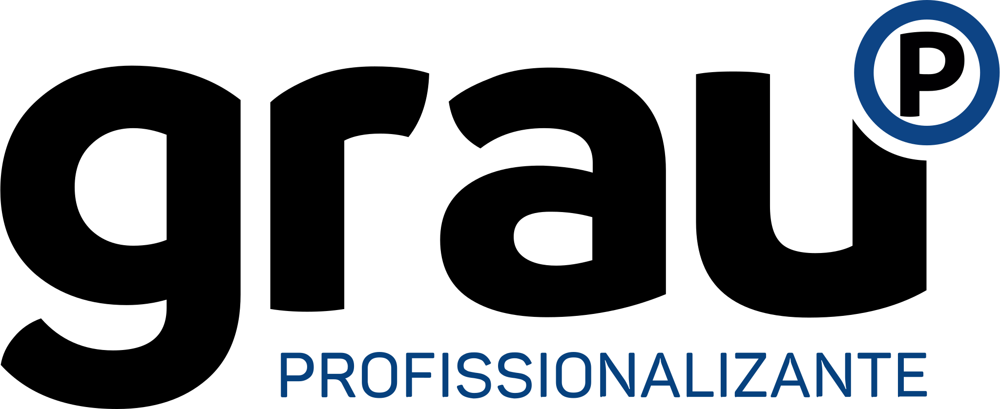
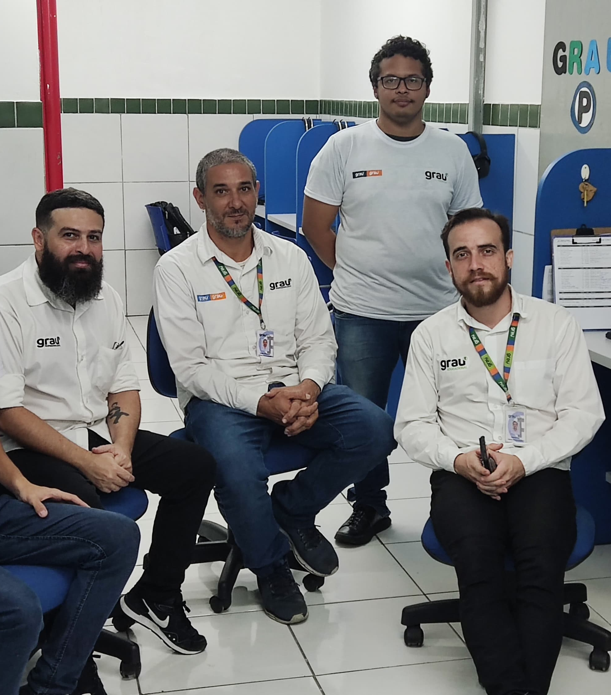

<div align="center">

</div>

# Programação

Esta reservatório é dedicado aos alunos de programação da Grau Profissionalizante Fortaleza Centro

-----
MENU -> [Desenvolvido por](#desenvolvido-por) | [Finalidade](#finalidade) | [Cursos](#cursos) | [Programas](#programas) |[Estrutura de Pastas](#estrutura-de-pastas) | [Outros links](#links)

-----

<a name="desenvolvido-por"></a>
## Desenvovido pela equipe de TI da Grau Técnico Centro Fortaleza:

- Raimundo Mário
- André Fernandes
- Queive Gomes
- Gabriel Dias
<div align="center">

</div>

<a name="finalidade"></a>
## Finalidade
Unificar conteúdo para os alunos Grau Profissionalizantes da unidade Centro Fortaleza

<a name="cursos"></a>
## Cursos
- [Lógica de Programação](html/)
- HTML
- CSS
- JavaScript
- Python


<a name="programas"></a>
## Programas
Lista de programas utilizados nos cursos
- Visualg [Download](./_assets/visualg3.0.7.rar)
- Notepad++ [Download](https://notepad-plus-plus.org/downloads)
- Visual Studio Code (VSCODE) [Download](https://code.visualstudio.com/download)

<a name="estrutura-de-pastas"></a>
## Estrutura de pastas

```
\_assets_    (Arquivos utilizados no Github)
\_Livros_    (Alguns livro para aprofundar e acessentar seus estudos)
\CSS        (Alguns arquivos voltados para o curso de CSS)
\HTML       (Alguns arquivos voltados para o curso de HTML)
\JavaScript (Alguns arquivos voltados para o curso de JavaScript)
\Lógica de Programação (Alguns arquivos voltados para o curso de Lógica de Programação)
\Python     (Alguns arquivos voltados para o curso de Python)

```

<a name="links"></a>
## Outros links

Matricule-se agora https://linklist.bio/SB9ZSzkcmT

Fale pelo WhatsApp https://linklist.bio/s9Hl5mI6ag

Facebook https://linklist.bio/BjUffDfvWD

Site oficial https://linklist.bio/L6TWQ2vgcJ
